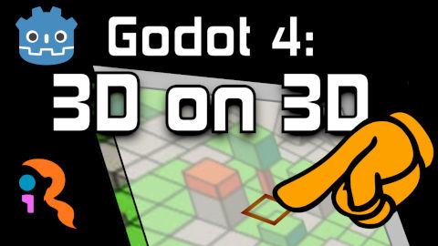
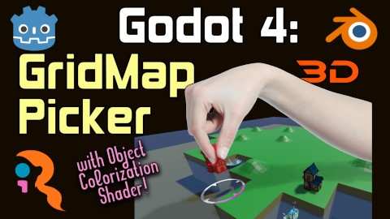
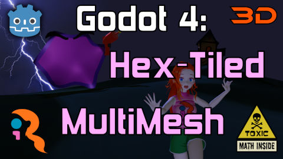
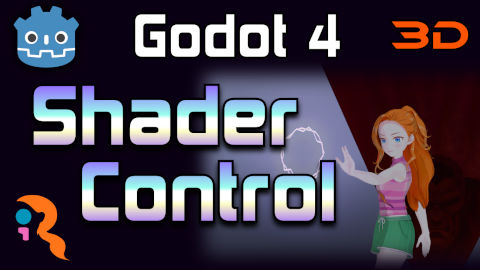

# Godot Video Tutorial Projects
Godot projects from homonymous video tutorials on YouTube.

1.
	[Godot 4 - 3D overlay on 3D scene ](iR001_godot4_3d_on_3d) 
	See the original video tutorial
	["Godot 4: 3D overlay on 3D scene" on YouTube](https://youtu.be/sZk6VKbbZHU)

1.
	[Godot 4 - GridMap Picker ](iR002_godot4_gridmap_picker) 
	See the original video tutorial
	["Godot 4: GridMap Picker" on YouTube](https://youtu.be/BYwRdLetEZA)

1.
	[Godot 4 - Hex-Tiled MultiMesh  (with fake Sere 3D model) ](iR003_godot4_hex_tiled_multimesh) 
	See the original video tutorial
	["Godot 4: Hex-Tiled MultiMesh" on YouTube](https://youtu.be/4n1xgpVd9qI)

1.
	[Godot 4 - Shader Control ](iR004_godot4_shader_control) 
	See the original video tutorial
	["Godot 4: Shader Control" on YouTube](https://youtu.be/UXGnmXZzmtY)

## Citation Game
If you just watched the videos and think you have a thorough knowledge of past and present video games, you can try the [Citation Game](CitationGame.md) ;)

## License
Those projects are distributed under the terms of the MIT license, as described in the [LICENSE](LICENSE) file.

Please, read [LICENSE](LICENSE) file to find attribution details about third-party assets and components.
